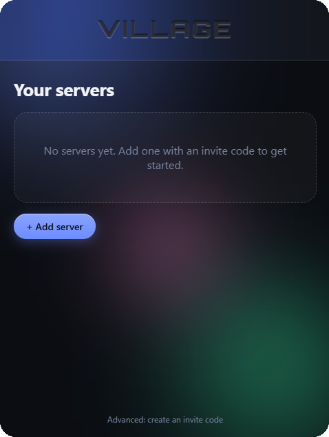
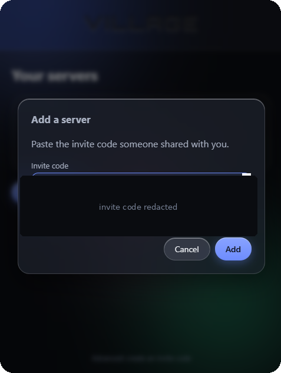
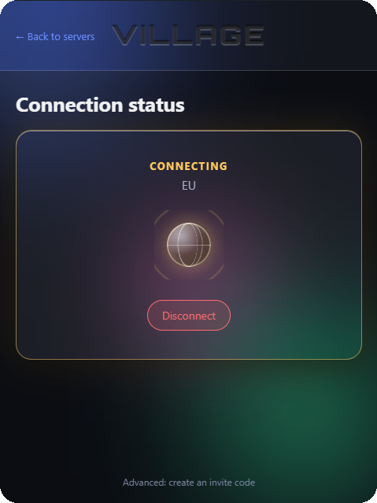
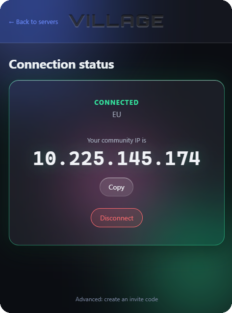
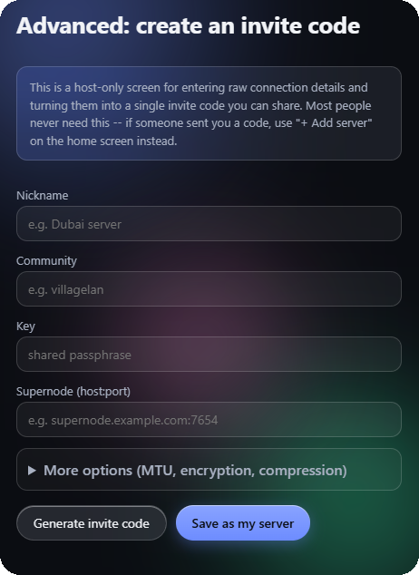

# Village

**Join your friends' private LAN with one pasted code. No CLI flags, no driver hunting, no "what's a supernode."**

[](https://github.com/christopherjude/world2village/releases/latest)
[](LICENSE)
[](#requirements)

Village is a small Windows app that turns [n2n](https://github.com/ntop/n2n) — a solid but very CLI/config-file-driven virtual LAN tool — into something you can hand to a non-technical friend with a one-line instruction: *"paste this code, click Connect."* It was built to get a small group playing **Command & Conquer: Generals** together online again, but it works for anything that wants a real LAN over the internet.

## Why

Getting a group of friends onto the same virtual LAN usually means walking each of them through community names, encryption keys, supernode addresses, driver installers, and a Windows elevation prompt they don't understand. Village collapses all of that into:

1. You (the host) generate an invite code once.
2. Your friend pastes it into Village and hits **Connect**.
3. They get a big, obvious, copyable IP address to paste into the game.

That's the whole interaction. Everything else — the driver install, the background service, the elevation prompt — happens automatically, once, behind a single Windows security prompt.

## Download

Grab the latest installer from the **[Releases page](https://github.com/christopherjude/world2village/releases/latest)**. Either the `.exe` (NSIS) or `.msi` works — the `.exe` is the simpler default.

> **Windows will show an "unrecognized app" SmartScreen warning.** Village isn't code-signed yet (see [Status](#status) below), so this is expected. Click **More info → Run anyway**. This won't happen again after install.

## What it looks like

A frosted-glass, dark-themed interface: a list of saved servers, a big color-coded connection state, and — once connected — your overlay IP shown large and copyable, ready to paste into your game's LAN IP field.

<p align="center">
  
  
  
  
</p>
<p align="center"><sub><b>Your servers</b> &nbsp;·&nbsp; <b>Add via invite code</b> &nbsp;·&nbsp; <b>Connecting…</b> &nbsp;·&nbsp; <b>Connected</b></sub></p>

## How to use it

**Joining a friend's network:**
1. Install Village, launch it.
2. First run: click **Set up Village** — one Windows security (UAC) prompt, one time only.
3. Click **+ Add server**, paste the invite code your friend gave you.
4. Click **Connect**. Once it says Connected, copy the IP shown and paste it into your game.

**Hosting for friends:**
1. You need a supernode reachable on the internet (Village doesn't run one for you — see [Architecture](#architecture)).
2. In Village, go to the small **Advanced** link at the bottom of the server list.
3. Fill in a nickname, a community name, an encryption key, and your supernode's `host:port`.
4. Click **Generate Invite Code** and send the resulting string to your friends. Optionally also **Save as My Server** so you can connect yourself.



*This screen is host-only — most people never see it. If someone sent you a code, you just need "+ Add server" on the home screen.*

Multiple servers are supported side by side — e.g. one for friends in the EU, one for friends in Asia — pick which one to connect to from the list.

## Requirements

- Windows 10 or 11, 64-bit.
- A supernode already running somewhere reachable (a small VPS is enough) if you're hosting — see n2n's own docs for running `supernode.exe`.

## Architecture

Village is a wrapper, not a reimplementation — it never touches the n2n protocol itself:

- **`edge.exe`** (n2n's actual client) does all the real networking. Village just builds its command-line arguments and manages its lifecycle.
- **A Windows Service**, installed once (the single UAC prompt), owns the elevated `edge.exe` process — because setting a network adapter's IP on Windows requires elevation, and asking users to "run as Administrator" every time isn't an option for non-technical friends. The GUI talks to this service over a locked-down local named pipe.
- **The `tap-windows6` driver** (OpenVPN's) provides the virtual network adapter. (We looked hard at using WinTun instead to avoid the classic per-arch driver-install pain — turns out that's not possible: WinTun is layer-3, n2n is layer-2, and the two are fundamentally incompatible. tap-windows6 it is, just automated so nobody has to install it by hand.)
- **Invite codes** are a compact, opaque string (`VLG1-...`) encoding a server's community, key, and supernode address — nothing more than a portable, shareable form of the same config you'd otherwise hand-type into n2n's CLI.

See [`CLAUDE.md`](CLAUDE.md) for the full set of implementation notes, hard-won gotchas, and product decisions if you're digging into the code.

## Building from source

Windows-only; a Linux/WSL2 dev box can edit and unit-test the portable Rust crates but can't produce a real build (Tauri needs GTK on Linux, or a native Windows target either way).

```
git clone https://github.com/christopherjude/world2village.git
cd world2village
```

You'll need, in `bin/` (gitignored, not vendored — see `bin/README.md`):
- `edge.exe`, built or downloaded from [ntop/n2n](https://github.com/ntop/n2n).
- `bin/tap-driver/{devcon.exe, OemVista.inf, tap0901.cat, tap0901.sys}`, from the `amd64/` folder of a [tap-windows6 release](https://github.com/OpenVPN/tap-windows6/releases).

Then, on a real Windows machine with Rust + MSVC Build Tools + `tauri-cli` installed:

```
cargo build --release -p village-service
cd src-tauri
cargo tauri build
```

The portable pieces (`crates/village-core`, `crates/village-ipc`) build and test on any platform:

```
cargo test
```

## Status

Working end-to-end — installs, connects, shows the overlay IP, tested on a real Windows machine. Not yet done:
- **Not code-signed**, hence the SmartScreen warning on first run. Investigating free/cheap options for an open-source project (SignPath, Azure Trusted Signing).
- A dedicated security review of the driver-install/subprocess/IPC code, beyond the checks already built into the design (argv-only subprocess calls, no shell interpolation, a closed IPC protocol, ACL'd named pipe).
- `edge.exe`'s exact version isn't pinned yet in `bin/README.md`.

## Credits

- [n2n](https://github.com/ntop/n2n) (GPLv3) — the actual VPN engine Village wraps. Village doesn't link against or redistribute n2n source, only invokes its compiled binaries as a subprocess, so Village's own MIT license is unaffected.
- [OpenVPN's tap-windows6](https://github.com/OpenVPN/tap-windows6) — the virtual network adapter driver.
- [happynclient/happynwindows](https://github.com/happynclient/happynwindows) — an earlier n2n Windows wrapper reviewed for UX/packaging ideas during design (not code reuse).
- [Orbitron](https://fonts.google.com/specimen/Orbitron) (SIL Open Font License) — the display font, self-hosted.

## License

MIT — see [`LICENSE`](LICENSE).
